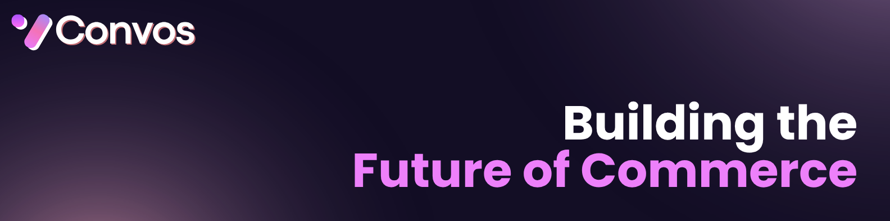

Convos is a self-hosted commerce OS for single-merchant brands that want full control over storefront, checkout, data, and AI-assisted shopping.It combines a production-ready storefront, merchant dashboard, and conversational buying experience without locking you into a hosted SaaS platform.

**License:** AGPL‑3.0‑only. See `LICENSE`.

## Quick deploy links

[](https://vercel.com/new/clone?repository-url=https://github.com/abhishek462307/Convos-Agentic-Commerce)
[](https://app.netlify.com/start/deploy?repository=https://github.com/abhishek462307/Convos-Agentic-Commerce)
[](https://render.com/deploy?repo=https://github.com/abhishek462307/Convos-Agentic-Commerce)
[](https://railway.app/new/template?template=https://github.com/abhishek462307/Convos-Agentic-Commerce)

- **Fly.io:** `https://fly.io/docs/apps/`
- **Docker (self‑host):** `docker compose up --build`

For any platform, you still need a Supabase project and environment configuration.

## What you get

**Storefront**
- Conversational shopping experience with cart and checkout
- AI‑assisted product discovery (optional)
- Product/category browsing and search

**Merchant dashboard**
- Products, variants, inventory, and collections
- Orders, refunds, and payment activity
- Customers and segmentation
- Store settings (brand, domain, SEO, shipping, email, and more)

**Setup and operations**
- First‑run setup flow for creating the initial merchant workspace
- Self‑host readiness checks in the dashboard
- Optional integrations for payments, AI, email, and messaging

## Architecture overview

- **Frontend:** Next.js 15 + React 19 + TypeScript
- **Backend:** Next.js App Router API routes
- **Database + Auth:** Supabase (Postgres + Auth)
- **Payments:** Stripe (optional)
- **AI:** OpenAI, Anthropic, Azure OpenAI (optional)

## Requirements

**Required**
- Node.js 20+
- npm 10+
- A Supabase project

**Optional integrations**
- OpenAI / Anthropic / Azure OpenAI (AI features)
- Stripe (payments)
- SMTP (transactional email)
- MCP (external assistant access)
- WhatsApp (via Baileys‑compatible bridge)

## Quick start (local development)

### 1. Install dependencies

```bash
npm ci
```

### 2. Create your local env file

```bash
cp .env.example .env.local
```

### 3. Set required environment variables

Minimum required values:

- `NEXT_PUBLIC_SUPABASE_URL`
- `NEXT_PUBLIC_SUPABASE_ANON_KEY`
- `SUPABASE_SERVICE_ROLE_KEY`
- `NEXT_PUBLIC_APP_URL`

For local development:

```env
NEXT_PUBLIC_APP_URL=http://localhost:3000
```

### 4. Bootstrap the database

Open the Supabase SQL Editor and execute these files in order:

```text
1. base_schema.sql
2. migration.sql
3. 01_rls_migration.sql
```

Notes:
- `base_schema.sql` creates the minimum tables required for a blank project.
- The setup wizard blocks merchant creation if required schema is missing.
- Running files out of order can leave the app partially initialized.

### 5. Start the app

```bash
npm run dev
```

### 6. Complete first‑run setup

1. Visit `http://localhost:3000`
2. Create an account or sign in
3. Complete `/setup` to create the first merchant workspace
4. You will be redirected to `/dashboard`

## First‑run flow (expected behavior)

1. Signed‑out users are redirected from `/` to `/login`.
2. Login/signup redirects to `/setup`.
3. Completing setup creates the merchant workspace.
4. The merchant dashboard loads.

If this does not happen, validate your Supabase keys and confirm the SQL bootstrap order.

## Supabase setup (recommended)

1. Create a new Supabase project.
2. Copy `Project URL` and `anon public key` for:
   - `NEXT_PUBLIC_SUPABASE_URL`
   - `NEXT_PUBLIC_SUPABASE_ANON_KEY`
3. Copy the **service role key** for:
   - `SUPABASE_SERVICE_ROLE_KEY`
4. Configure Auth redirect URLs to match your `NEXT_PUBLIC_APP_URL`:
   - `https://your-domain.com/*`
   - `http://localhost:3000/*` for local testing
5. Run the SQL bootstrap files in order.

## Environment variables

All variables are documented in `.env.example`. Only core Supabase values are required for first boot. Everything else is optional unless the feature is enabled.

### Required

- `NEXT_PUBLIC_SUPABASE_URL`
- `NEXT_PUBLIC_SUPABASE_ANON_KEY`
- `SUPABASE_SERVICE_ROLE_KEY`
- `NEXT_PUBLIC_APP_URL`

### Optional integrations

- **AI:** `OPENAI_*`, `ANTHROPIC_*`, `AZURE_OPENAI_*`
- **Stripe:** `STRIPE_SECRET_KEY`, `NEXT_PUBLIC_STRIPE_PUBLISHABLE_KEY`, `STRIPE_PLATFORM_WEBHOOK_SECRET`
- **SMTP:** `PLATFORM_SMTP_*`
- **MCP:** `MCP_API_KEY`, `MCP_CLIENT_SECRET`, `MCP_JWT_SECRET`
- **WhatsApp:** `BAILEYS_*`

If a provider is not configured, keep those values empty and the feature will remain disabled.

### Internal secrets (production)

Set strong values in production:

- `MIGRATION_SECRET`
- `INTERNAL_API_SECRET`
- `EMAIL_INTERNAL_SECRET`
- `CRON_SECRET`
- any MCP secrets you use

## Docker

```bash
cp .env.example .env.local
docker compose up --build
```

The container runs the Next.js app only. Supabase remains an external dependency.

## Deployment guidance (detailed)

### Vercel

1. Create a new project from your GitHub repo.
2. Add required environment variables (see above).
3. Set `NEXT_PUBLIC_APP_URL` to your Vercel domain.
4. Add the Vercel URL to Supabase Auth redirect URLs.
5. Deploy.

### Netlify / Render / Railway

1. Connect the repo and configure build command: `npm run build`
2. Set start command: `npm run start`
3. Add required environment variables
4. Update Supabase Auth redirect URLs to include your domain

### Fly.io / VPS / self‑managed

1. Build the app using `npm run build`
2. Run `npm run start` in production mode
3. Set env variables in your process manager or container
4. Add your domain to Supabase Auth redirect URLs

## Production checklist

Before going live:

1. Set `NEXT_PUBLIC_APP_URL` to your HTTPS domain.
2. Update Supabase auth redirect URLs to match that domain.
3. Set strong values for internal secrets.
4. Configure payment webhooks if Stripe is enabled.
5. Validate the install in `Settings -> Self‑Host Setup`.

## Troubleshooting

- **Login/Setup fails:** missing or incorrect Supabase keys.
- **Auth redirect loops:** `NEXT_PUBLIC_APP_URL` mismatch or missing Supabase redirect URL.
- **Setup blocked:** SQL bootstrap not fully applied or run out of order.
- **Payments not working:** missing Stripe keys or webhook secret.

## Security reporting

Please do not report vulnerabilities in public issues. See `SECURITY.md` for the correct channels.

## Documentation

- Self‑hosting: `docs/SELF_HOSTING.md`
- Contributing: `CONTRIBUTING.md`
- Security: `SECURITY.md`
- Code of conduct: `CODE_OF_CONDUCT.md`
